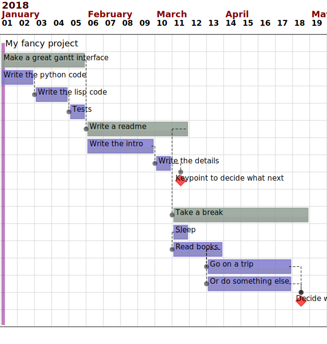

# myGantt

This is an attempt tu use the very nice python-gantt library in combination with emacs org-mode.

## Dependencies
You'll need python-gantt and arrow for the python executable
`sudo -H pip3 install python-gantt arrow`
On the emacs side you'd like to install org-mode

## Usage

in your emacs org file you need a block like (use yasnippets for the tasks)
```lisp
* My fancy project
SCHEDULED: <2018-01-01 lun.>
:PROPERTIES:
:COLUMNS: %Id %ITEM(Description) %Parent %EFFORT(Duration) %Before %After %SCHEDULED(Start) %DEADLINE(End) %Type
:Id:       P
:END:
** Make a great gantt interface
:PROPERTIES:
:Id:       L1
:END:
*** Write the python code 
:PROPERTIES:
:Id:       1.1
:Parent:   L1
:EFFORT: 2w
:END:
*** Write the lisp code
:PROPERTIES:
:EFFORT: 2w
:Id:       1.2
:Parent:   L1
:After:    1.1
:END:
*** Tests
:PROPERTIES:
:After:    1.2
:EFFORT: 1w
:Parent:   L1
:Id:       1.3
:END:
** Write a readme
:PROPERTIES:
:Id:       L2
:After:    L1
:END:
*** Write the intro
:PROPERTIES:
:Id:       2.1
:Parent:   L2
:EFFORT: 4w
:END:
*** Write the details
:PROPERTIES:
:Id:       2.2
:Parent:   L2
:EFFORT:   1w
:Before:  
:After: 2.1
:END:
*** Keypoint to decide what next
:PROPERTIES:
:Id: 2.3
:Parent: L2
:EFFORT: 
:Before: 
:After: 2.2
:Type: KP
:END:
** Take a break
:PROPERTIES:
:Id: L3
:Parent: 
:EFFORT:
:Before:
:After: L2
:Type:
:END:
*** Sleep
:PROPERTIES:
:Id:       3.1
:Parent:   L3
:EFFORT:   2d
:Before:
:After:
:Type:
:END:
*** Read books
   :PROPERTIES:
   :Id: 3.2
   :Parent: L3
   :EFFORT: 2w
   :Before: 
   :After: 3.1
   :Type: 
   :END:
*** Go on a trip
   :PROPERTIES:
   :Id: 3.3.1
   :Parent: L3
   :EFFORT: 1m
   :Before: 
   :After: 3.2
   :Type: 
   :END:
*** Or do something else
:PROPERTIES:
      :Id: 3.3.2
      :Parent: L3
      :EFFORT: 1m
      :Before: 
      :After: 3.2
      :Type: 
      :END:
*** Decide what to do next
  :PROPERTIES:
  :Id: 3.4
  :Parent: L3
  :EFFORT: 
  :Before: 
  :After: 3.3.1,3.3.2
  :Type:     KP
  :END:
   

#+BEGIN: columnview :hlines 2 :id "P"
#+name: planning
|    Id | Description                  | Parent | Duration | Before |       After | Start             | End | Type |
|-------+------------------------------+--------+----------+--------+-------------+-------------------+-----+------|
|     P | My fancy project             |        |          |        |             | <2018-01-01 lun.> |     |      |
|-------+------------------------------+--------+----------+--------+-------------+-------------------+-----+------|
|    L1 | Make a great gantt interface |        |          |        |             |                   |     |      |
|   1.1 | Write the python code        | L1     | 2w       |        |             |                   |     |      |
|   1.2 | Write the lisp code          | L1     | 2w       |        |         1.1 |                   |     |      |
|   1.3 | Tests                        | L1     | 1w       |        |         1.2 |                   |     |      |
|-------+------------------------------+--------+----------+--------+-------------+-------------------+-----+------|
|    L2 | Write a readme               |        |          |        |          L1 |                   |     |      |
|   2.1 | Write the intro              | L2     | 4w       |        |             |                   |     |      |
|   2.2 | Write the details            | L2     | 1w       |        |         2.1 |                   |     |      |
|   2.3 | Keypoint to decide what next | L2     |          |        |         2.2 |                   |     | KP   |
|-------+------------------------------+--------+----------+--------+-------------+-------------------+-----+------|
|    L3 | Take a break                 |        |          |        |          L2 |                   |     |      |
|   3.1 | Sleep                        | L3     | 2d       |        |             |                   |     |      |
|   3.2 | Read books                   | L3     | 2w       |        |         3.1 |                   |     |      |
| 3.3.1 | Go on a trip                 | L3     | 1m       |        |         3.2 |                   |     |      |
| 3.3.2 | Or do something else         | L3     | 1m       |        |         3.2 |                   |     |      |
|   3.4 | Decide what to do next       | L3     |          |        | 3.3.1,3.3.2 |                   |     | KP   |
#+END:
#+begin_src sh :var tasks=planning tmpFile="/tmp/myGantt.txt" svgFile="./Images/Test.svg" format="w" :results value code
   echo "$tasks" > /tmp/myGantt.txt
   ~/Projects/myGantt/myGantt.py "$tmpFile" "$svgFile" "$format"
#+end_src

```
Then if you execute the column view and the the dynamic block (C-c C-c while somewhere between #+begin_src and #+end_src) then you'll get :
```lisp
#+RESULTS:
#+BEGIN_SRC sh
Project My fancy project
╔ My fancy project 86 days ═══╬════╩════╩════╩════╩════╩════╬════╩════╩════╩════╩════╩
╠═Make a great gantt interface 
╚═Write the python code 
          ╚═Write the lisp code 
                    ╚═Tests 
                         ╠═Write a readme ---------
                         ╚═Write the intro --
                                             ╚═Write the details 
                                                  ╚█Keypoint to decide what next 
                                                   ╠═Take a break --------------------
                                                   ╚═Sleep 
                                                     ╚═Read books 
                                                               ╚═Go on a trip -------
                                                               ╚═Or do something else 
                                                                                     ╚█Decide what to do next 
#+END_SRC
```
and a nice svg file :

